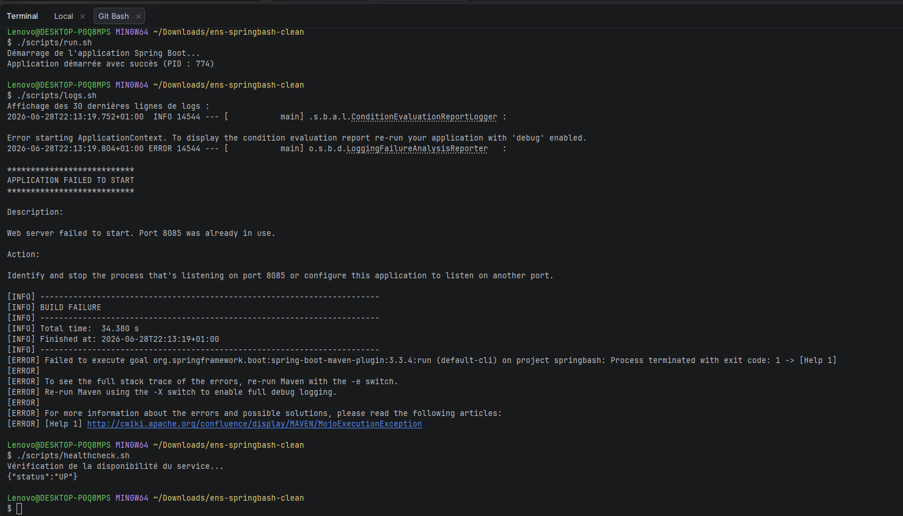
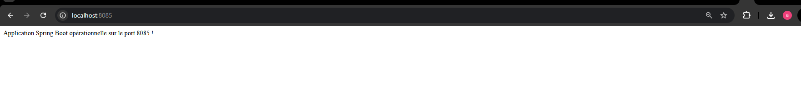
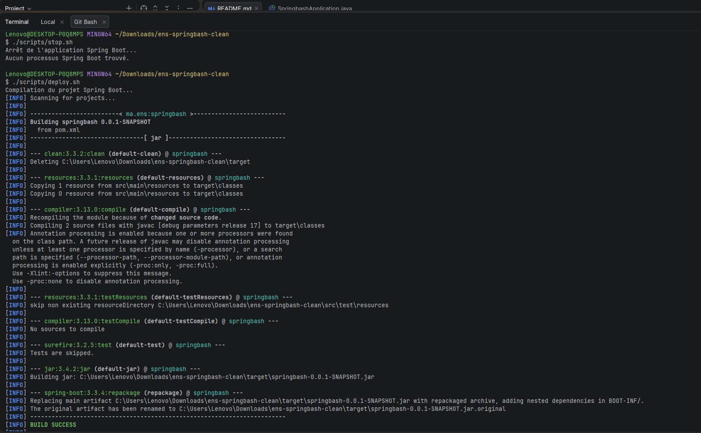
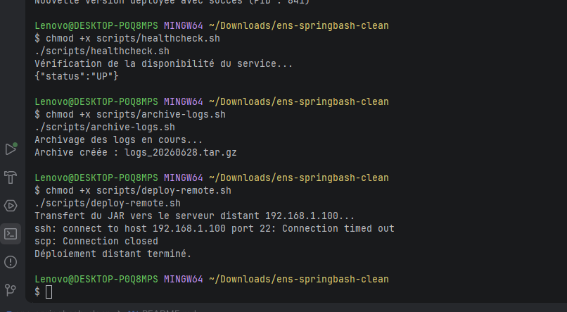

# TP Spring Boot + Bash — ens-springbash

## Structure du projet

```
ens-springbash/
├── pom.xml
├── README.md
├── logs/
├── scripts/
│   ├── run.sh
│   ├── stop.sh
│   ├── logs.sh
│   ├── deploy.sh
│   ├── healthcheck.sh
│   ├── archive-logs.sh
│   └── deploy-remote.sh
└── src/main/
    ├── java/ma/ens/springbash/
    │   ├── SpringbashApplication.java
    │   └── HomeController.java
    └── resources/
        └── application.properties
```

---

## Port utilisé

L'application tourne sur le port **8085** → http://localhost:8085

---

##  Scripts Bash sous Windows

Les scripts `.sh` nécessitent **Git Bash** ou **WSL2**.

Ouvrir un terminal Git Bash dans IntelliJ :
`View > Terminal` → sélectionner Git Bash

---

## Étape 3 — Exécution

```bash
# Donner les permissions
chmod +x scripts/*.sh

# Lancer l'application
./scripts/run.sh

# Vérifier les logs
./scripts/logs.sh
```


```bash

# Accéder dans le navigateur
http://localhost:8085
```


```bash
# Arrêter
./scripts/stop.sh

# Compiler et déployer le JAR
./scripts/deploy.sh
```



---

## Étape 4 — Approfondissement

```bash
# Healthcheck
chmod +x scripts/healthcheck.sh
./scripts/healthcheck.sh

# Archiver les logs
chmod +x scripts/archive-logs.sh
./scripts/archive-logs.sh

# Déploiement SSH distant (modifier USER et SERVEUR dans le script)
chmod +x scripts/deploy-remote.sh
./scripts/deploy-remote.sh
```

---

## Fichiers ajoutés par rapport au TP

- **`SpringbashApplication.java`** — classe principale Spring Boot, indispensable.
- **`HomeController.java`** — endpoint GET `/` pour tester http://localhost:8085 sans erreur 404.
- **`spring-boot-starter-actuator`** — nécessaire pour `healthcheck.sh`.
- **`management.endpoints.web.exposure.include=health,info`** — expose `/actuator/health`.
- **`healthcheck.sh`**, **`archive-logs.sh`**, **`deploy-remote.sh`** — scripts bonus Étape 4.
- **`logs/.gitkeep`** — maintient le dossier `logs/` lors du push sur git.
